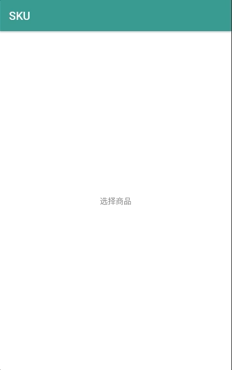

# SKU

### 效果图如下



### sku相关数据
SKU相关数据大致如下，其他参数可根据自身项目自由扩展

```
{
  "pid": 10001,//商品id
  "pictureUrl"://商品主图
   "https://timgsa.baidu.com/timg?image&quality=80&size=b9999_10000&sec=1564393109966&di=95d3036dc6282a14fda223c3b55284be&imgtype=0&src=http%3A%2F%2Fimg4.vipshop.com%2Fupload%2Fmerchandise%2F27600%2FZIMMUR-ZMCQ2028-2.jpg",
  "stockQuantity": 939,//商品总库存
  "maxPrice": 199.0000,//最高价
  "minPrice": 699.0000,//最低价
  "skus": [
    {
      "sid": 10001,//skuid
      "price": 199.0000,//价格
      "pictureUrl": //商品图
      "https://timgsa.baidu.com/timg?image&quality=80&size=b9999_10000&sec=1564393109966&di=95d3036dc6282a14fda223c3b55284be&imgtype=0&src=http%3A%2F%2Fimg4.vipshop.com%2Fupload%2Fmerchandise%2F27600%2FZIMMUR-ZMCQ2028-2.jpg",
      "stockQuantity": 133,//该商品库存
      "attributes": [
        {
          "value": "M",
          "key": "尺码"
        },
        {
          "value": "绿松石蓝色",
          "key": "颜色"
        }
      ]
    } 
  ]
}

```

### 相关设置：

1.不同状态显示的设置
sku_item_text_selector.xml                   sku单item字体显示的三种状态设置
sku_item_selector.xml                        sku单item显示的三种状态设置
quantity_operator_text_selector.xml          加减按钮的状态设置
sku_quantity_input_selector.xml              输入框两种输入状态设置
sku_quantity_minus_selector.xml              减按钮的背景状态设置
sku_quantity_plus_selector.xml               加按钮的背景状态设置

2.最大高度、最小高度设置
SkuMaxHeightScrollView中可在xml中设置maxSkuHeight、minSkuHeight，而SkuSelectScrollView继承自SkuMaxHeightScrollView也可直接设置

```
<com.madreain.sku.view.SkuSelectScrollView
     android:id="@+id/scroll_sku_list"
     android:layout_width="match_parent"
     android:layout_height="wrap_content"
     app:maxSkuHeight="230"
     app:minSkuHeight="88"
     android:layout_marginTop="5dp" />
```


